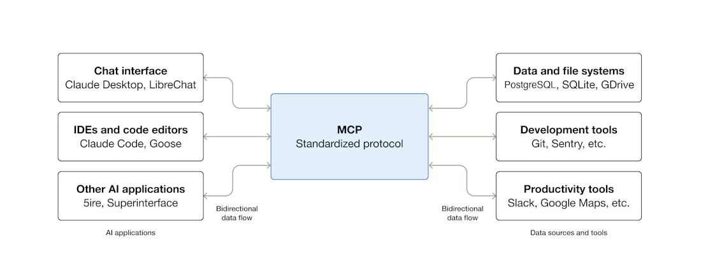

# MCP Foundational Learning Guide
## 5 Core Modules for Understanding Model Context Protocol

**Version: 1.0 - Foundational Focus**
**Based on Official MCP Documentation**

> **📖 This is Guide 1 of 2.** Start here to understand what MCP is, why it matters, and how it works.
> When you're done, continue to `2_MCP_Ultimate_Comprehensive_Guide.md` for architecture deep dives and hands-on building.

---

## 📚 Complete Table of Contents

- [Module 1: Introduction & Why MCP Matters](#module-1-introduction--why-mcp-matters)
    - [What is MCP?](#what-is-mcp)
    - [Why Does MCP Matter?](#why-does-mcp-matter)
    - [Real-World Impact Examples](#real-world-impact-examples)
    - [The Business Value of MCP](#the-business-value-of-mcp)
- [Module 2: Understanding the Problem — The N×M Complexity](#module-2-understanding-the-problem---the-nm-complexity)
    - [The N × M Problem Explained](#the-n--m-problem-explained)
    - [Real-World Examples of the N × M Problem](#real-world-examples-of-the-n--m-problem)
    - [The Economic Impact](#the-economic-impact)
- [Module 3: Simple Analogies to Get Started](#module-3-simple-analogies-to-get-started)
    - [Analogy 1: USB-C Port](#analogy-1-usb-c-port-the-official-analogy)
    - [Analogy 2: Universal Restaurant System](#analogy-2-universal-restaurant-system)
    - [Analogy 3: Tower of Babel Translator](#analogy-3-tower-of-babel-translator)
    - [Analogy 4: LEGO Bricks vs Custom Toys](#analogy-4-lego-bricks-vs-custom-toys)
    - [Analogy 5: One Remote vs Many Remotes](#analogy-5-one-remote-vs-many-remotes)
- [Module 4: How MCP Works — The Complete Picture](#module-4-how-mcp-works---the-complete-picture)
    - [The Three Key Participants](#the-three-key-participants-official-terminology)
    - [The Protocol: JSON-RPC 2.0](#the-protocol-json-rpc-20)
    - [The Four Core Capabilities](#the-four-core-capabilities)
    - [The Two Layers of MCP](#the-two-layers-of-mcp)
    - [How Discovery Works](#how-discovery-works)
- [Module 5: Real-World Industry Examples](#module-5-real-world-industry-examples)
    - [Financial Services](#financial-services-investment-portfolio-analysis)
    - [E-Commerce: AI Customer Support](#e-commerce-ai-customer-support)
    - [Software Development: AI Pair Programmer](#software-development-ai-pair-programmer)
    - [Healthcare: Medical Research Assistant](#healthcare-medical-research-assistant)
    - [Enterprise: Internal Data Analysis](#enterprise-internal-data-analysis)
- [Module 6: Data Types & Schemas (Python Perspective)](#module-6-data-types--schemas-python-perspective)
- [Conclusion: Why These 5 Modules Matter](#conclusion-why-these-5-modules-matter)

---

---

# Module 1: Introduction & Why MCP Matters

## The Core Question: Why Should You Care About MCP?

Imagine you're a knowledge worker in 2024. Every day, you use multiple AI tools:
- ChatGPT for brainstorming
- Claude for detailed analysis
- Gemini for research
- M365 Copilot for office work
- Your company's custom AI for internal data

But here's the problem: **None of them can access your real data.**

Your AI assistants are isolated from:
- Your calendar and meetings
- Your emails and communications  
- Your company's databases
- Your files and documents
- Your projects and tasks
- Your customer data
- Your financial records

So they can help you brainstorm, but they can't see your actual calendar conflict.
They can write code, but they can't access your database schema.
They can analyze, but they can't see your company data.

**This is what MCP solves.**

## What is MCP?

**MCP (Model Context Protocol) is an open-source standard that enables AI applications to safely and securely access external systems and data sources.**

Think of it as:
- A **universal connector** for AI (like USB-C for electronic devices)
- A **standard language** that AI and data sources speak
- A **bridge** between AI applications and the real world

## Why Does MCP Matter?

### For End Users (People Using AI)

**Before MCP:**
```
You: "What do I have scheduled tomorrow?"
AI: "I don't know. I can't access your calendar."

You: "Can you analyze our sales trends?"
AI: "I don't have access to your database."

You: "Draft an email summary from my meeting notes"
AI: "I can't read your files."
```

**After MCP:**
```
You: "What do I have scheduled tomorrow?"
AI: (checks calendar) "You have 3 meetings: ..."

You: "Can you analyze our sales trends?"
AI: (queries database) "Based on your Q3 data: ..."

You: "Draft an email summary from my meeting notes"
AI: (reads files) "Here's a summary based on your notes: ..."
```

**The difference:** Your AI becomes actually useful for YOUR context, not just general questions.

### For Developers (People Building AI Tools)

**Before MCP:**
```
Building an AI customer service chatbot?

Need to integrate with:
├─ Ticketing System (write custom connector)
├─ Product Database (write custom connector)
├─ Order History (write custom connector)
├─ Email System (write custom connector)
└─ Knowledge Base (write custom connector)

= 5 custom integrations
= 2 weeks per integration
= 10 weeks of development
= Fragile (breaks when systems update)
```

**After MCP:**
```
Building an AI customer service chatbot?

Just connect to:
├─ Ticketing MCP Server
├─ Product MCP Server
├─ Order History MCP Server
├─ Email MCP Server
└─ Knowledge Base MCP Server

= All implement the same standard
= 1 week to integrate all of them
= Robust (each system maintains its own server)
= Updates don't break your code
```

### For Companies (Organizations)

**Impact:**
- Faster AI deployment (weeks instead of months)
- Lower development costs (fewer engineers needed)
- Better security (standardized authentication)
- Easier maintenance (updates happen independently)
- Competitive advantage (better AI capabilities faster)

## Real-World Impact Examples

### Example: Investment Firm

**Before:** Takes 3 months to build portfolio analysis AI
- Integrate Bloomberg Terminal (2 weeks)
- Integrate internal database (2 weeks)
- Integrate news feeds (2 weeks)
- Debug issues (3 weeks)
- Deploy carefully (2 weeks)

**With MCP:** Takes 2 weeks to deploy portfolio analysis AI
- Connect Bloomberg MCP Server (1 day)
- Connect internal MCP Server (1 day)
- Connect news feed MCP Server (1 day)
- Integrate with Claude (3 days)
- Deploy and test (4 days)

**Savings:** 6 weeks, 1 engineer, cost savings of $50K+

### Example: Customer Support

**Before:** Support chatbot can't answer most questions
- "I don't have access to your account info"
- "I can't check if we have that in stock"
- "I don't know your shipping status"

**With MCP:** Support chatbot solves 80% of issues
- Checks account history automatically
- Queries inventory in real-time
- Tracks shipments instantly
- Provides accurate information
- Escalates when needed

**Savings:** Reduced support tickets by 70%

### Example: Software Development

**Before:** Developers can't get AI help with their code
- AI can see code snippets but not full context
- AI doesn't understand project structure
- AI can't check if similar patterns exist elsewhere
- AI guesses based on limited information

**With MCP:** Developers get intelligent pair programming
- AI reads entire codebase
- AI understands project architecture
- AI finds similar patterns in existing code
- AI makes informed suggestions
- AI can even make targeted changes

**Benefit:** Developers write code 2x faster

## The Business Value of MCP

| Metric | Before MCP | With MCP | Improvement |
|--------|-----------|----------|-------------|
| Time to integrate new system | 2-4 weeks | 1-2 days | 10x faster |
| Lines of integration code | 500-1000 | 50-100 | 10x less code |
| Systems maintained by same team | 1-2 | 5-10 | 5x more systems |
| Cost per integration | $10K-20K | $1K-2K | 10x cheaper |
| System updates breaking things | Weekly | Rarely | 100x more reliable |

## What This Means Going Forward

MCP represents a fundamental shift in how AI applications work:

```
Old Model:
AI Application → Custom Code → System 1
              → Custom Code → System 2  
              → Custom Code → System 3
(Every connection is custom, fragile, and expensive)

New Model (MCP):
AI Application → MCP Protocol → Server 1
              → MCP Protocol → Server 2
              → MCP Protocol → Server 3
(One standard, robust, and efficient for all)
```

This is revolutionary because:
1. **It's a standard** - Everyone uses the same protocol
2. **It's modular** - Each system can implement independently
3. **It's secure** - Authentication handled consistently
4. **It's scalable** - Easy to add new systems
5. **It's maintainable** - Each team maintains their own piece

## Key Takeaways

✅ MCP solves a fundamental problem in AI integration
✅ It makes AI actually useful for real-world scenarios
✅ It saves time and money for developers
✅ It enables better AI experiences for end users
✅ It's becoming the standard for AI integration

**Next:** Understand the specific problem MCP solves (the N×M Complexity)

---

---

# Module 2: Understanding the Problem - The N×M Complexity

## The Integration Problem Nobody Talks About

When AI tools first became useful, companies got excited:

```
"We can use Claude for analysis!"
"We can use ChatGPT for customer support!"
"We can use Gemini for research!"
"We can use M365 Copilot for office work!"
"We can use our custom model for proprietary data!"
```

But then reality hit:

```
"How do we connect Claude to our database?"
"How do we give ChatGPT access to our CRM?"
"How do we let Gemini read our documents?"
"How do we let our model access our APIs?"
```

Each question required building a completely custom integration.

## The N × M Problem Explained

**What is it?**

If you have:
- N different AI applications
- M different data sources/systems

You need: **N × M custom integrations**

### Concrete Example

**Scenario:** Your company has:

**AI Applications:**
1. Claude (for analysis)
2. ChatGPT (for customer service)
3. Gemini (for research)
4. Custom internal model

**Data Sources:**
1. PostgreSQL Database
2. Salesforce CRM
3. GitHub Repositories
4. Google Drive
5. Email System

**Math:**
```
4 AI Applications × 5 Data Sources = 20 Custom Integrations

Visualization:
        AI Tools
          1 2 3 4
         ┌─┬─┬─┬─┐
Data 1   │ │ │ │ │  (4 connectors to Database)
Data 2   │ │ │ │ │  (4 connectors to Salesforce)
Data 3   │ │ │ │ │  (4 connectors to GitHub)
Data 4   │ │ │ │ │  (4 connectors to Drive)
Data 5   │ │ │ │ │  (4 connectors to Email)
         └─┴─┴─┴─┘

Every box needs a custom integration!
```

### The Cost of N × M

**Development Time:**
```
20 integrations × 2 weeks each = 40 weeks
40 weeks = ~10 months of one engineer
Or: 5 engineers for 8 weeks

Cost: $40K - $80K just in development
```

**Maintenance Burden:**
```
Claude updates? Check all 5 integrations
ChatGPT updates? Check all 5 integrations
Salesforce updates? Check all 4 integrations
GitHub updates? Check all 4 integrations
Database schema changes? Check all 4 integrations

Almost constant firefighting
```

**Quality Issues:**
```
Each integration:
- Different authentication method
- Different error handling
- Different timeout logic
- Different retry strategy
- Different response format
- Different performance characteristics

Result: Unpredictable behavior, hard to debug
```

## Real-World Examples of the N × M Problem

### Example 1: Slack's Integration Challenge

**The Story:**

Slack wanted to integrate with many services. Before standardization, every integration was custom:

```
2015: Slack with 20 integrations
Problem: Each one different
Cost: Huge team just maintaining integrations
Quality: Frequent issues when services updated
```

What they really needed: One standard that every service implements.

### Example 2: Enterprise AI Deployment

**Company: Healthcare Provider**

They wanted to deploy Claude for medical research. Needed access to:
1. Patient database (secure, HIPAA-compliant)
2. Medical literature database
3. Lab results system
4. Radiology images system
5. Insurance claims system

**The Problem:**
```
5 custom integrations × 8 weeks each = 40 weeks
Cost: $100K+ in engineering
Timeline: 9 months before launch
Risk: Any system update could break everything
```

**With MCP (hypothetically):**
```
Each system implements MCP: 5-8 weeks total
Integration with Claude: 2 weeks
Total: 3 months instead of 9
Cost: $20K instead of $100K
Risk: Updates handled by each system independently
```

### Example 3: Developer Productivity Tool

**Company:** Software consulting firm

They wanted to build an AI that helps developers. Needed access to:
1. GitHub repositories
2. Jira issue tracker
3. Confluence wiki
4. Company codebase
5. Database schema
6. API documentation
7. Slack channels

**The Nightmare:**
```
7 integrations × 2 weeks each = 14 weeks
Plus testing: 2 weeks
Plus debugging: 2 weeks
Total: 18 weeks = 4.5 months

And every time GitHub updates their API? Weeks of rework.
```

## Visualizing the Problem

### The Exponential Growth

```
Small company (2 AIs, 3 systems): 6 integrations
Growing company (4 AIs, 5 systems): 20 integrations
Large company (8 AIs, 10 systems): 80 integrations
Enterprise (15 AIs, 20 systems): 300 integrations

Each integration needs maintenance, testing, debugging.
Maintenance cost grows exponentially.
```

### The Update Problem

Every time ANY system updates, potential cascading failures:

```
Day 1:  GitHub updates API format
        └─ Breaks integration with Claude
        └─ Breaks integration with ChatGPT
        └─ Breaks integration with Gemini
        └─ Breaks integration with custom model
        = 4 emergency fixes needed

Day 2:  Salesforce updates authentication
        └─ Breaks 4 different integrations
        = 4 more emergency fixes

Day 3:  Database schema changes
        └─ Breaks 4 different integrations
        = 4 more emergency fixes

Every week: Multiple systems updating = Multiple fires to fight
```

## The Economic Impact

### Development Costs Comparison

**Traditional Integration (N × M Approach):**

```
Company: 5 AI Tools, 8 Data Sources = 40 Integrations

Development Phase:
- 40 integrations × 2 weeks each = 80 weeks
- Cost: $200K (at typical rates)

First Year Maintenance:
- Bug fixes and patches = $50K
- System updates handling = $50K
- Feature additions = $30K
Total Year 1: $330K

Second Year Maintenance:
- Same as year 1: $130K
- Plus technical debt paydown: $50K
Total Year 2: $180K

5-Year Cost: $330K + $180K × 4 = $1.05 Million
```

**With MCP Standardization:**

```
Company: 5 AI Tools, 8 Data Sources

Development Phase:
- 5 tools implement MCP = 5 weeks
- 8 data sources implement MCP = 8 weeks
- Integration = 2 weeks
Total: 15 weeks
Cost: $50K

First Year Maintenance:
- Infrastructure upkeep = $10K
- Monitoring = $10K
Total Year 1: $70K

Second Year Maintenance:
- Same as year 1: $20K
Total Year 2: $20K

5-Year Cost: $70K + $20K × 4 = $150K
```

**Savings: $900K over 5 years for one company!**

## Key Insights About N × M Complexity

1. **It grows exponentially** - Adding one more AI = N more integrations needed
2. **It's fragile** - Any system update risks breaking multiple things
3. **It's expensive** - Not just development, but ongoing maintenance
4. **It's slow** - Takes months to integrate new systems
5. **It scales badly** - Enterprises have this problem 100x worse

## The Real Cost: Opportunity Cost

Beyond the direct costs, there's the opportunity cost:

```
Without MCP, teams spend time:
✗ Building custom connectors
✗ Debugging integration issues
✗ Dealing with API changes
✗ Maintaining brittle code

Instead of:
✓ Building actual features
✓ Improving products
✓ Helping customers
✓ Innovating
```

If your team spends 50% of their time on integration, you're losing 50% of your innovation capacity.

## Key Takeaways

✅ N × M problem is fundamental in AI integration
✅ It causes exponential growth in complexity
✅ It's incredibly expensive (hundreds of thousands to millions)
✅ It slows down deployment significantly
✅ Updates from any system cause cascading failures
✅ The opportunity cost is even higher than direct costs

**Next:** See how simple analogies make this concept clear

---

---

# Module 3: Simple Analogies to Get Started

## Why Analogies Matter

The N × M problem is abstract. Analogies make it concrete and easy to understand.

## Analogy 1: USB-C Port (The Official Analogy)

### Before USB-C

```
You have 3 devices:
├─ Laptop
├─ Phone
└─ Tablet

You travel to 3 countries:
├─ USA (Type A outlets)
├─ Europe (Type C outlets)
└─ UK (Type G outlets)

How many adapters do you need?
3 devices × 3 outlet types = 9 adapters!

And you have to remember which adapter goes where.
```

### With USB-C

```
You have 3 devices:
├─ All with USB-C
├─ All with USB-C
└─ All with USB-C

You travel to 3 countries:
├─ All with USB-C
├─ All with USB-C
└─ All with USB-C

How many adapters do you need?
0. Just one cable works everywhere.

Or maybe 1 adapter if older outlets exist.
But the standard works everywhere.
```

### How This Maps to MCP

```
Before MCP:
3 AI Tools × 5 Data Sources = 15 custom connectors

With MCP:
3 AI Tools × 5 Data Sources = All use same standard
(The "USB-C" of AI integration)
```

## Analogy 2: Universal Restaurant System

### The Problem

```
You're hungry. You want to order from 5 restaurants:

McDonald's:
- Call them
- Their voice menu system
- Their ordering process
- Their payment system

Subway:
- Use their app
- Different interface
- Different process
- Different payment

Pizza Hut:
- Order online
- Website interface
- Different process
- Different payment

Taco Bell:
- Go in person
- Walk-in only
- Different process
- Different payment

Chipotle:
- Kiosk system
- Kiosk interface
- Different process
- Different payment

You have to learn 5 completely different systems!
```

### The Solution

```
All restaurants implement ONE ordering standard:

1. View menu (same format)
2. Select items (same interface)
3. Customize items (same process)
4. Checkout (same payment)
5. Get confirmation (same format)

Now you learn ONE system.
You can order from ANY restaurant.
Everything works the same way.
```

### Real-World Application

```
Before MCP:
Claude: "I can only work with GitHub (learned their system)"
ChatGPT: "I can only work with Salesforce (learned theirs)"
Gemini: "I can only work with Slack (learned theirs)"

With MCP:
All AI Tools: "We work with any MCP server"
GitHub: "We implement MCP standard"
Salesforce: "We implement MCP standard"
Slack: "We implement MCP standard"

Any AI tool instantly works with any system!
```

## Analogy 3: Tower of Babel Translator

### The Problem

```
You need information from 5 sources that speak different languages:

Database speaks: SQL
GitHub speaks: REST API format
Slack speaks: Their webhook format
Google Drive speaks: Google API format
Email speaks: IMAP/SMTP protocol

You have to learn all 5 languages to get the information.

If you add a 6th source that speaks a new language?
Learn the 6th language.

It's like the Tower of Babel - everyone speaks different languages!
```

### The Solution (MCP as Translator)

```
You (AI): "I need data"
           (speak in simple English)

MCP Translator (Server): 
  ├─ Understands SQL (translates database)
  ├─ Understands REST (translates GitHub)
  ├─ Understands Slack format (translates messages)
  ├─ Understands Google API (translates Drive)
  └─ Understands IMAP (translates emails)

Data comes back to you in one standard format.

You never deal with the complexity.
The translator handles all the languages.
```

## Analogy 4: LEGO Bricks vs Custom Toys

### Before MCP (Custom Toys)

```
You want to build 5 toy houses.

House 1: Uses custom wooden blocks
  - Learn how to use wooden blocks
  - Buy wooden blocks
  - Build with wooden blocks
  - If you want windows, build custom windows

House 2: Uses custom plastic pieces
  - Learn different rules for plastic
  - Buy plastic pieces
  - Build with plastic
  - If you want windows, build custom windows again

House 3: Uses custom metal frames
  - Learn completely different system
  - Buy metal components
  - Build with metal
  - Build custom windows again

House 4: Uses custom ceramic pieces
  - Learn new system
  - Buy ceramics
  - Build with ceramics
  - Build custom windows again

House 5: Uses custom stone blocks
  - Learn new system
  - Buy stones
  - Build with stones
  - Build custom windows again

Result: You're an expert in 5 different building systems
        You've built custom windows 5 times
        Everything is incompatible
```

### With MCP (LEGO)

```
You want to build 5 house designs.

All use LEGO bricks:
- Learn LEGO once
- Buy LEGO bricks
- Build house 1 with LEGO
  └─ Add window piece (standard LEGO window)

Build house 2 with same LEGO
  └─ Add same window pieces

Build house 3, 4, 5 with same LEGO
  └─ Use same standard windows

Result: You're expert in ONE building system
        You build windows once
        Everything is compatible
        You can build 5x faster
```

## Analogy 5: One Remote vs Many Remotes

### Before MCP

```
Your living room has:
├─ TV (with its own remote)
├─ Sound system (with its own remote)
├─ Lights (with their own remote)
├─ Air conditioning (with its own remote)
├─ Projector (with its own remote)

You have 5 remotes to control 5 devices.
Each remote has different buttons.
Each remote works differently.

When you want to watch a movie, you need to:
1. Pick up TV remote (on coffee table)
2. Pick up sound system remote (on shelf)
3. Pick up lights remote (on wall)
4. Pick up AC remote (by door)
5. Operate each one

Plus you need to learn all their interfaces!
```

### With MCP (Universal Remote)

```
Your living room has:
├─ TV (supports MCP)
├─ Sound system (supports MCP)
├─ Lights (support MCP)
├─ Air conditioning (supports MCP)
├─ Projector (supports MCP)

One universal remote controls all of them!

When you want to watch a movie, you:
1. Pick up one remote
2. Say: "Movie mode" or use one interface
3. Everything adjusts automatically:
   - TV turns on
   - Lights dim
   - Sound system activates
   - AC maintains temperature
```

## Comparing the Analogies

| Aspect | USB-C | Restaurant | Translator | LEGO | Remote |
|--------|-------|-----------|------------|------|--------|
| Main point | Universal connector | Standard interface | Standard language | Standard building block | Standard control |
| Complexity shown | Physical incompatibility | Different processes | Different APIs | Different materials | Different interfaces |
| Real-world relatable | Very | Very | Somewhat | Very | Very |
| Technical accuracy | High | Medium | High | High | Medium |
| Easiest to explain | Very easy | Easy | Needs setup | Very easy | Very easy |

## Using These Analogies in Practice

### When explaining to non-technical people:
Use: **USB-C analogy** or **Universal Remote**
Why: Visual, physical, immediately relatable

### When explaining to business leaders:
Use: **Restaurant analogy** or **Universal Remote**
Why: Shows efficiency and cost savings

### When explaining to developers:
Use: **Translator analogy** or **LEGO analogy**
Why: Shows technical abstraction and standardization

### When explaining the problem (N×M):
Use: **USB-C** or **Restaurant**
Why: Shows the explosion of combinations

## Key Insights from Analogies

✅ **Standard = Simpler** - One standard beats many customs every time
✅ **Universal = Cheaper** - One solution beats N×M combinations
✅ **Compatible = Faster** - Everything works together seamlessly
✅ **Modular = Maintainable** - Each part can be updated independently

**Next:** Understand exactly how MCP works in practice

---

---

# Module 4: How MCP Works - The Complete Picture

## The Complete MCP System

### The Three Key Participants (Official Terminology)

**1. MCP Host**
- The application you use (Claude Desktop, VSCode, custom app)
- Manages the overall experience
- Coordinates multiple clients
- You interact with this

**2. MCP Client**
- Component inside the host (one per server)
- Maintains connection to ONE server
- Handles protocol conversation
- You never see this

**3. MCP Server**
- Program that provides functionality
- Exposes tools, resources, prompts
- Runs locally or remotely
- You don't directly interact with this



### Visual Architecture

```
┌─────────────────────────────────────────┐
│         YOU (User)                      │
│    Interacting with the Host            │
└──────────────────┬──────────────────────┘
                   │
┌──────────────────▼──────────────────────┐
│       MCP HOST (Claude Desktop)         │
│                                         │
│  • Displays user interface              │
│  • Manages AI context                   │
│  • Coordinates clients                  │
│                                         │
│  Contains:                              │
│  ├─ MCP Client 1 ─┐                    │
│  ├─ MCP Client 2 ─┼─ (invisible)       │
│  └─ MCP Client 3 ─┘                    │
└─┬────────────┬────────────┬────────────┘
  │            │            │
  ↓            ↓            ↓
┌────────┐ ┌────────┐ ┌────────┐
│Server 1│ │Server 2│ │Server 3│
│        │ │        │ │        │
│Tools   │ │Tools   │ │Tools   │
│& Data  │ │& Data  │ │& Data  │
└────────┘ └────────┘ └────────┘
```


### Real Example: Claude Desktop with Three Servers

**Setup:**
```json
{
  "mcpServers": {
    "files": {
      "command": "node",
      "args": ["/path/to/filesystem/server.js"]
    },
    "github": {
      "command": "node", 
      "args": ["/path/to/github/server.js"]
    },
    "database": {
      "command": "node",
      "args": ["/path/to/database/server.js"]
    }
  }
}
```

**What happens when you ask Claude something:**

```
You: "Show me recent GitHub commits and my calendar for tomorrow"

Claude Desktop (Host) thinks:
  "I need to:"
  ├─ Get calendar from files server
  ├─ Get GitHub data from github server
  └─ Combine and present

Claude Desktop routes through clients:
  ├─ Client 1 calls: "List events for tomorrow"
  │  └─ Files Server responds with calendar data
  ├─ Client 2 calls: "Get recent commits"
  │  └─ GitHub Server responds with commit data
  
Claude Desktop synthesizes:
  "Here are your events for tomorrow:
   - 9 AM: Team standup
   - 2 PM: Client call
   
   Recent commits:
   - Fixed login bug (Sarah, 2 hours ago)
   - Added new feature (You, 1 hour ago)"
```

## How Requests and Responses Work

### The Protocol: JSON-RPC 2.0

All MCP communication uses the same format:

**Request (Client → Server):**
```json
{
  "jsonrpc": "2.0",
  "id": 1,
  "method": "tools/call",
  "params": {
    "name": "get_calendar_events",
    "arguments": {
      "date": "2024-06-15"
    }
  }
}
```

**Response (Server → Client):**
```json
{
  "jsonrpc": "2.0",
  "id": 1,
  "result": {
    "content": [{
      "type": "text",
      "text": "Events for June 15:\n9 AM - Team standup\n2 PM - Client call\n4 PM - 1:1 with manager"
    }]
  }
}
```

### Key Points About the Protocol

1. **Standardized** - Every request and response follows same structure
2. **Typed** - The "method" tells what operation (tools/call, resources/read, etc.)
3. **Parameterized** - Arguments are clearly defined
4. **Structured Response** - Returns content in standard format
5. **Error Handling** - Standard way to report errors

### The Four Core Capabilities

**Server-Side (What servers provide):**

1. **Tools** (AI-controlled actions)
   - Get weather
   - Book a meeting
   - Send an email
   - Query a database
   - Create a file

2. **Resources** (Application-selected context)
   - File contents
   - Database schemas
   - Documentation
   - Previous conversations

3. **Prompts** (User-invoked templates)
   - "Plan my day"
   - "Analyze these documents"
   - "Generate a report"

**Client-Side (What clients can do):**

4. **Sampling** (Servers ask AI for help)
   - Analyze complex data
   - Generate text
   - Make decisions
   - Synthesize information

### Complete Request-Response Cycle

```
┌─────────────────────────────────────────────┐
│ You: "What's the weather in London?"        │
└────────────────┬────────────────────────────┘
                 │
┌────────────────▼────────────────────────────┐
│ Claude (Host) receives question              │
│ "I need to call get_weather tool"           │
└────────────────┬────────────────────────────┘
                 │
┌────────────────▼────────────────────────────┐
│ Client 1 creates JSON-RPC request:          │
│ {                                            │
│   "method": "tools/call",                   │
│   "params": {                               │
│     "name": "get_weather",                  │
│     "arguments": {"city": "London"}         │
│   }                                          │
│ }                                            │
└────────────────┬────────────────────────────┘
                 │
┌────────────────▼────────────────────────────┐
│ Weather Server receives request             │
│ Processes: get_weather(city="London")       │
│ Queries weather API or database             │
└────────────────┬────────────────────────────┘
                 │
┌────────────────▼────────────────────────────┐
│ Server creates JSON-RPC response:           │
│ {                                            │
│   "result": {                               │
│     "content": [{                           │
│       "type": "text",                       │
│       "text": "London: 59°F, Cloudy"       │
│     }]                                      │
│   }                                          │
│ }                                            │
└────────────────┬────────────────────────────┘
                 │
┌────────────────▼────────────────────────────┐
│ Client 1 receives response                  │
│ Passes to Claude (Host)                     │
└────────────────┬────────────────────────────┘
                 │
┌────────────────▼────────────────────────────┐
│ Claude synthesizes final answer:            │
│ "The weather in London is 59°F and cloudy.  │
│  You might want to bring an umbrella!"      │
└────────────────┬────────────────────────────┘
                 │
┌────────────────▼────────────────────────────┐
│ You see: "The weather in London is..."      │
└─────────────────────────────────────────────┘
```

## The Two Layers of MCP

### Layer 1: Data Layer (What to communicate)

- **JSON-RPC 2.0 format** - How messages are structured
- **Lifecycle management** - Initializing, terminating connections
- **Primitives** - Tools, Resources, Prompts, Sampling
- **Notifications** - Real-time updates

### Layer 2: Transport Layer (How to communicate)

Two options:

**STDIO Transport (Local):**
- Direct pipe between processes
- On your computer
- No network overhead
- Single client connection
- Fast and efficient

**HTTP Transport (Remote):**
- HTTP POST requests
- On a server/cloud
- Standard web protocols
- Multiple clients
- OAuth support

### Real-World Examples of Both Transports

**STDIO (Local):**
```
Claude Desktop
    │
    └─ (direct pipe) ─→ File System Server (running on your computer)
```

**HTTP (Remote):**
```
Claude Desktop
    │
    └─ (HTTP request) ─→ Weather Service (running on weather.com servers)
```

## How Discovery Works

### Tool Discovery

**Client asks:** "What tools do you have?"
```json
{
  "jsonrpc": "2.0",
  "id": 1,
  "method": "tools/list"
}
```

**Server responds:** "Here's my list"
```json
{
  "result": {
    "tools": [
      {
        "name": "get_weather",
        "description": "Get weather for a city",
        "inputSchema": {
          "type": "object",
          "properties": {
            "city": {"type": "string"}
          },
          "required": ["city"]
        }
      },
      {
        "name": "get_forecast",
        "description": "Get forecast for next 7 days",
        "inputSchema": {
          "type": "object",
          "properties": {
            "city": {"type": "string"}
          },
          "required": ["city"]
        }
      }
    ]
  }
}
```

**Claude sees both tools and can use either one.**

### Real-Time Updates

Servers can notify clients when tools change:

```
Server: "My tools list changed!"
        (sends: tools/list_changed notification)

Client: "OK, let me get the updated list"
        (calls: tools/list)

Client: "Claude, you now have these tools..."
```

## Complete Workflow Example

**Scenario:** Customer asks support chatbot a complex question

```
Question: "Where's my order? Is it in stock? And can I return it?"

Timeline:

T+0ms:   Support Chatbot (Host) receives question
T+10ms:  Creates 3 client requests simultaneously:
         ├─ Client 1: "Get order status"
         ├─ Client 2: "Check inventory"
         └─ Client 3: "Check return policy"

T+50ms:  Orders Server responds: "Order #12345 shipped yesterday"
T+55ms:  Inventory Server responds: "That product is in stock"
T+60ms:  Returns Server responds: "30-day return policy applies"

T+65ms:  Chatbot synthesizes:
         "Your order #12345 is currently shipped 
          and should arrive tomorrow. Yes, the product 
          is in stock. You have 30 days to return it 
          if needed."

T+70ms:  Customer sees answer
         (Total time: 70 milliseconds!)
```

## Key Concepts About How MCP Works

✅ **Standard Protocol** - Same format everywhere
✅ **Modular** - Each server independent
✅ **Secure** - Authentication built-in
✅ **Scalable** - From 1 to 100+ servers
✅ **Fast** - Low-latency responses
✅ **Reliable** - Defined error handling
✅ **Discoverable** - Clients can find capabilities
✅ **Real-time** - Notifications for updates

**Next:** See how this works in real companies

---

---

# Module 5: Real-World Industry Examples

## Financial Services: Investment Portfolio Analysis

### The Scenario

**Investment firm wants to give portfolio managers an AI assistant that can:**
- Access internal portfolio database
- Query real-time market data (Bloomberg)
- Read regulatory documents
- Analyze company earnings reports
- Check compliance rules

### Before MCP: The Traditional Integration

**Timeline:**
```
Week 1-2:   Build PostgreSQL → AI connector
Week 2-3:   Build Bloomberg → AI connector
Week 3-4:   Build document system → AI connector
Week 4-5:   Build earnings data → AI connector
Week 5-6:   Build compliance rules → AI connector
Week 6-8:   Debug integration issues
Week 8-10:  Security review and fixes
Week 10-12: Performance optimization
Week 12-16: Production stabilization and fixes

Total: 4 months
Cost: $150K+
Quality: Still fragile (breaks when systems update)
```

### With MCP: The Modern Integration

**Timeline:**
```
Week 1:     Portfolio DB team builds MCP server
Week 1:     Bloomberg team builds MCP server
Week 1:     Document team builds MCP server
Week 1:     Earnings team builds MCP server
Week 1:     Compliance team builds MCP server
Week 2:     AI integration (all servers simultaneously)
Week 3:     Testing and production launch

Total: 3 weeks
Cost: $30K
Quality: Robust (each team maintains their server)
Benefit: Updates handled independently
```

### Real Usage Example

**Portfolio manager asks:**
```
"Analyze our top 10 holdings against current market conditions,
 considering our risk tolerance and regulatory constraints"
```

**What happens behind the scenes:**

```
Claude (Host) gets question
├─ Client 1 calls: "Get top 10 holdings"
│  └─ Portfolio Server returns: (holdings data)
├─ Client 2 calls: "Get market data for these stocks"
│  └─ Bloomberg Server returns: (current prices, volatility, trends)
├─ Client 3 calls: "Get regulatory constraints"
│  └─ Compliance Server returns: (applicable rules)
└─ Client 4 calls: "Get company earnings"
   └─ Earnings Server returns: (recent reports)

Claude synthesizes all data and provides:
✓ Risk analysis
✓ Regulatory compliance check
✓ Market outlook
✓ Actionable recommendations
```

**Result:** Complex analysis in seconds instead of hours

---

## E-Commerce: AI Customer Support

### The Scenario

**E-commerce company wants chatbot that can:**
- Check order status
- Handle returns/refunds
- Provide product information
- Access customer history
- Process simple requests

### Before MCP

**Problem:**
```
Build custom connectors for:
├─ Order database
├─ Inventory system
├─ Refund system
├─ Customer database
└─ Email system

Each one breaks when systems update.
Updates to any system = chatbot breaks.
Support team spends 30% time on integration issues.
```

**Result:**
```
Chatbot is limited and brittle.
Many questions require escalation to human.
Customer satisfaction: 60%
```

### With MCP

**Architecture:**
```
Claude Desktop (Host)
├─ Client 1 ←→ Orders MCP Server
├─ Client 2 ←→ Inventory MCP Server
├─ Client 3 ←→ Refunds MCP Server
├─ Client 4 ←→ Customers MCP Server
└─ Client 5 ←→ Email MCP Server
```

**Real Examples:**

**Customer:** "Where's my order?"
```
Claude calls: get_order_status("ORDER_12345")
Server returns: {status: "shipped", tracking: "..."}
Claude responds: "Your order is shipped and arriving tomorrow!"
```

**Customer:** "Can I return this?"
```
Claude calls multiple servers:
├─ get_order_details("ORDER_12345")
├─ check_return_eligibility()
├─ get_return_policy()
Claude responds: "Yes, you have 30 days. Process starts in one click."
```

**Customer:** "Why is this product out of stock?"
```
Claude calls:
├─ get_inventory_status()
├─ get_restock_date()
Claude responds: "Back in stock June 15. Want us to notify you?"
```

**Result:**
```
Chatbot solves 85% of issues automatically.
Escalations reduced by 70%.
Customer satisfaction: 92%
Support team focus: 80% on complex issues, 20% on oversight.
```

---

## Software Development: AI Pair Programmer

### The Scenario

**Dev team wants AI that can:**
- Understand entire codebase
- Review code changes
- Suggest improvements
- Find relevant patterns
- Write tests

### Before MCP

**Problem:**
```
AI can see code snippets but:
✗ Can't access full repository
✗ Can't understand project structure
✗ Can't find similar patterns
✗ Can't check if solution already exists
✗ Works with limited context

Result: Generic, unhelpful suggestions
```

### With MCP

**Architecture:**
```
IDE (Host)
├─ Client 1 ←→ GitHub MCP Server
├─ Client 2 ←→ Database Schema Server
├─ Client 3 ←→ CI/CD Status Server
└─ Client 4 ←→ Code Analysis Server
```

**Real Example:**

**Developer types:** "Write a function to handle user authentication"

**Claude accesses via MCP:**
```
├─ Reads existing auth code (GitHub)
├─ Finds similar patterns in codebase
├─ Checks database schema (Users table)
├─ Verifies build passes (CI/CD)
└─ Analyzes security requirements
```

**Claude provides:**
```
"I found 3 similar auth functions. You probably want to:
1. Use the existing UserRepository pattern
2. Follow the existing error handling from line 234
3. Add these tests (based on existing test patterns)
4. Make sure it passes security lint (check CI/CD config)"
```

**Result:**
```
✓ Code follows existing patterns
✓ Fewer security issues
✓ Better consistency
✓ Faster development
Developers write code 2x faster with proper context.
```

---

## Healthcare: Medical Research Assistant

### The Scenario

**Hospital wants AI that can:**
- Access patient cases (HIPAA-secure)
- Query medical literature
- Check drug interactions
- Analyze test results
- Provide research context

### Before MCP

**Problem:**
```
Each system requires:
├─ Custom HIPAA-compliant connector
├─ Custom authentication
├─ Custom security measures
├─ Custom audit logging

Takes months to set up securely.
Very expensive.
High risk of compliance violations.
```

### With MCP

**Architecture:**
```
Hospital AI (Host)
├─ Client 1 ←→ Patient DB MCP Server (HIPAA-protected)
├─ Client 2 ←→ Medical Lit MCP Server
├─ Client 3 ←→ Drug Database MCP Server
└─ Client 4 ←→ Lab Results MCP Server
```

**Security built-in:**
```
Each server:
✓ Handles HIPAA compliance itself
✓ Manages its own authentication
✓ Implements its own audit logging
✓ Enforces its own access controls

Central standard:
✓ Consistent security baseline
✓ Auditable throughout
✓ Compliant architecture
```

**Real Example:**

**Doctor asks:** "What's the best treatment for this patient?"

**Claude accesses:**
```
├─ Patient medical history (Patient Server)
├─ Lab results (Lab Server)
├─ Drug interactions (Drug Server)
├─ Latest research (Medical Lit Server)
```

**Claude provides:**
```
"Based on patient history and labs:
- Treatment A has 85% success (cite recent study)
- Drug interactions: minimal concern (lists them)
- Dosage considerations: check kidney function
- Alternative options: (lists with research citations)"
```

**Result:**
```
✓ Better patient outcomes
✓ HIPAA compliant from day 1
✓ Evidence-based recommendations
✓ Faster clinical decisions
```

---

## Enterprise: Internal Data Analysis

### The Scenario

**Large company wants to democratize data access:**

"All employees should be able to ask questions about company data"

**Data sources:**
```
├─ Sales database (100GB+)
├─ Customer data (50GB+)
├─ Financial records (30GB+)
├─ Operations metrics (20GB+)
├─ HR data (10GB+)
└─ Product analytics (50GB+)
```

### Before MCP

**Problem:**
```
Building data integrations traditionally:
- Each database team would need to build BI tools
- Each BI tool would be different
- Employees learn different query languages
- Data access becomes political bottleneck
- Months to add new data source
```

### With MCP

**Architecture:**
```
Enterprise AI (Host)
├─ Client 1 ←→ Sales DB MCP Server
├─ Client 2 ←→ Customers DB MCP Server
├─ Client 3 ←→ Finance DB MCP Server
├─ Client 4 ←→ Operations DB MCP Server
├─ Client 5 ←→ HR DB MCP Server (with auth controls)
└─ Client 6 ←→ Analytics MCP Server
```

**Real Examples:**

**Sales person:** "What were our top 10 customers last quarter?"
```
Claude queries Sales Server
Returns: (top customers with revenue)
```

**Manager:** "Show me department headcount by location"
```
Claude queries HR Server
Returns: (with role-based access control)
```

**Executive:** "What's our Q3 revenue projection?"
```
Claude queries:
├─ Finance data
├─ Sales pipeline
├─ Operations capacity
Synthesizes: "Projected Q3 revenue: $50M (95% confidence)"
```

**Product Manager:** "Which features are most used by power users?"
```
Claude queries Analytics Server
Returns: (usage patterns by user segment)
```

**Result:**
```
✓ Data democracy achieved
✓ Self-service analytics
✓ Better business decisions
✓ Data team focuses on data quality, not integrations
✓ New data sources added in days, not months
```

---

---

# Conclusion: Why These 5 Modules Matter

## What You've Learned

### Module 1: Introduction & Why MCP Matters
✅ Understands MCP is a solution to a real problem
✅ Knows why developers, users, and companies care
✅ Recognizes the business value

### Module 2: Understanding the Problem
✅ Understands N × M complexity
✅ Sees why integrations are expensive and fragile
✅ Recognizes exponential growth problem

### Module 3: Simple Analogies
✅ Can explain MCP to anyone using USB-C, restaurants, etc.
✅ Understands core concepts through familiar examples
✅ Can communicate the value clearly

### Module 4: How MCP Works
✅ Understands the three participants (Host, Client, Server)
✅ Knows the request-response cycle
✅ Recognizes the two layers (Data, Transport)

### Module 5: Real-World Examples
✅ Sees MCP applied in actual industries
✅ Understands real business benefits
✅ Recognizes patterns across domains

### Module 6: Data Types & Schemas (Python Perspective)
✅ Understands mapping of Python types to JSON Schema
✅ Sees practical examples of complex type definitions
✅ Recognizes how to define tool inputs for Python developers

## Key Takeaways

**MCP is revolutionary because:**
1. ✅ It's a **standard** that everyone can use
2. ✅ It solves the **N × M problem** fundamentally
3. ✅ It **saves time and money** at scale
4. ✅ It makes AI **actually useful** for real data
5. ✅ It enables **faster innovation** in the AI space

## Next Steps

Now that you understand the 5 foundational concepts, move to **Guide 2: MCP Ultimate Comprehensive Guide** (`2_MCP_Ultimate_Comprehensive_Guide.md`). 

> **💡 Tip:** Guide 2 starts with a brief recap of the foundations. You can skip straight to the new material.

### Recommended Reading Path in Guide 2:

| If you want to... | Start at |
|:---|:---|
| **Go deeper into architecture** | Part 2: Architecture Deep Dive |
| **Understand Tools/Resources/Prompts** | Part 3: Understanding MCP Servers |
| **Learn Client features (Elicitation, Sampling)** | Part 4: Understanding MCP Clients |
| **Clarify Client vs Host** | Part 5: Client vs Host |
| **Start building immediately** | Part 6: Using Local MCP Servers |
| **Build your own server** | Part 7: Building Your Own MCP Server |
| **Deploy to production** | Part 9: Remote Servers & Cloud |

### Want a Networking Refresher?

If you want to understand **what's underneath** MCP (TCP, HTTP, JSON-RPC, STDIO):
→ Open `../Networking_essentials_dev/handson_networking.md` for 11 progressive coding lessons.

---

## Resource Links

- **Official MCP Documentation:** https://modelcontextprotocol.io
- **MCP Specification:** https://modelcontextprotocol.io/specification
- **Official Servers:** https://github.com/modelcontextprotocol/servers
- **Community Resources:** https://modelcontextprotocol.io/community

---

**Congratulations! You now have a solid foundational understanding of MCP.**

These 5 modules give you the context to dive deeper into any aspect of MCP that interests you.

🚀 **Ready to go further? Open `2_MCP_Ultimate_Comprehensive_Guide.md` → Part 2.**

