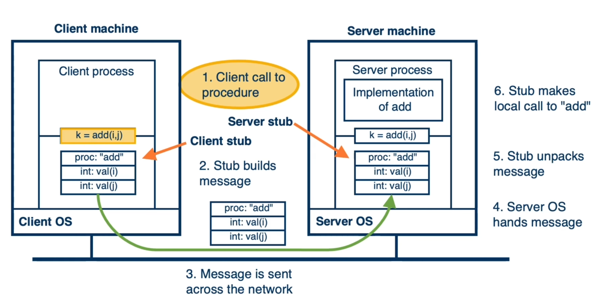
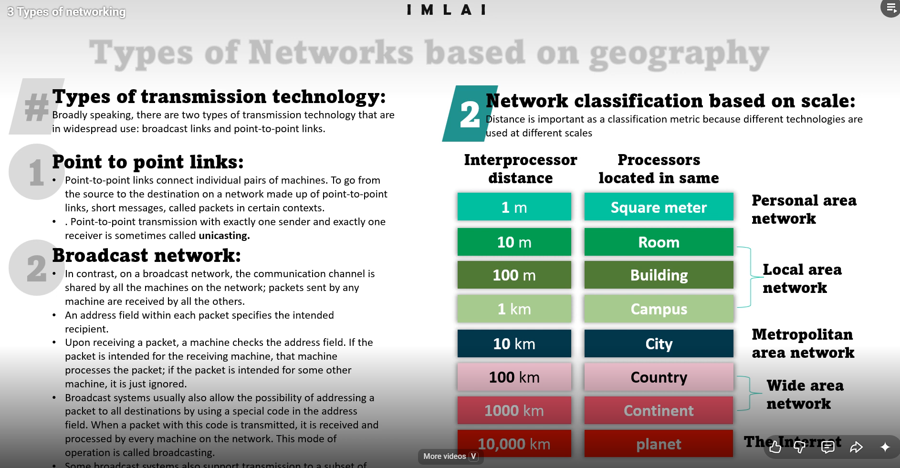
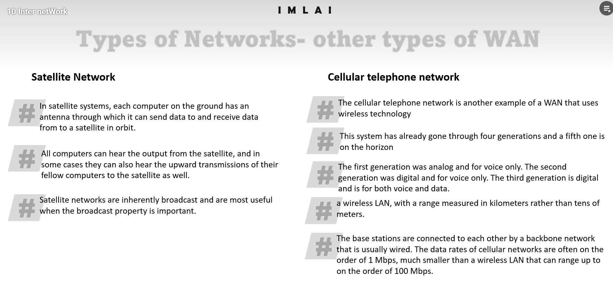
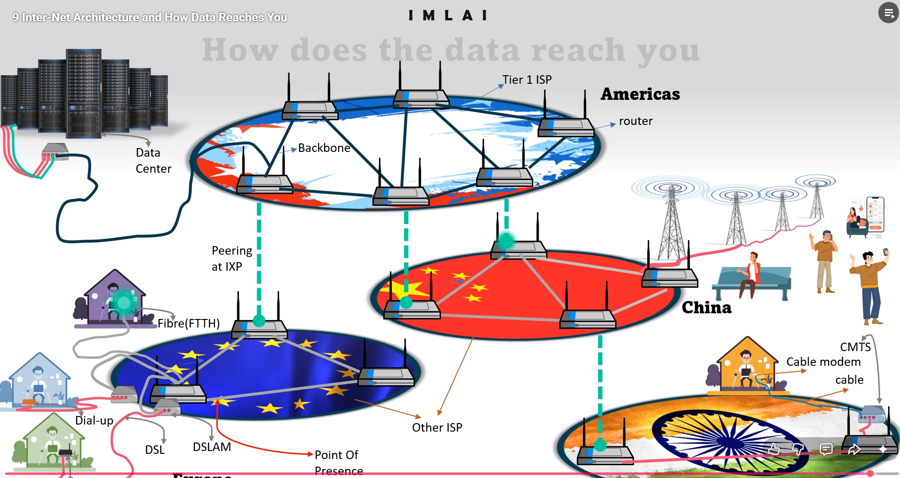
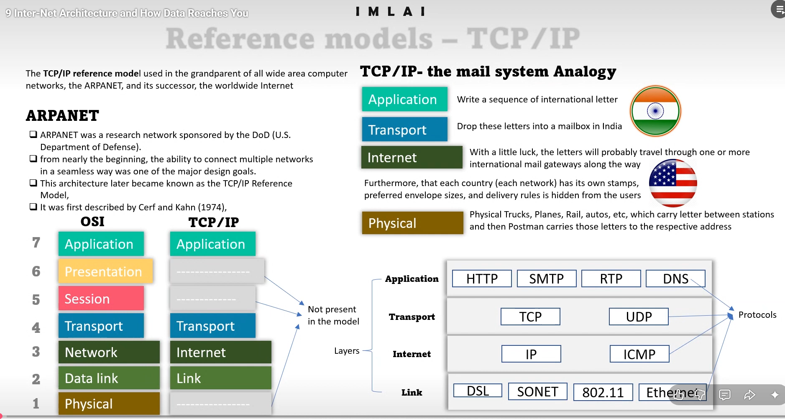

# Networking Fundamentals for Software & Agentic Development
## A Practical Guide for the AI-First Era

Welcome to the **Networking Fundamentals** tutorial. This guide is designed to bridge the gap between traditional software networking and the modern world of **Agentic AI**—specifically focusing on how protocols like **MCP (Model Context Protocol)** rely on these foundational concepts.

---

## 📚 Course Curriculum

- [Module 1: Data Representation](#module-1-data-representation---the-building-blocks)
- [Module 2: Data Interchange Formats](#module-2-data-interchange-formats---structuring-data-for-exchange)
    - [2.3 RPC (Remote Procedure Call)](#23-rpc-remote-procedure-call--calling-functions-across-machines)
    - [2.4 JSON-RPC — The MCP Standard](#24-json-rpc--rpc-meets-json-the-mcp-standard)
- [Module 3: Communication Protocols](#module-3-communication-protocols---the-delivery-mechanisms)
    - [3.4 Network Classification & Transmission Technology](#34-network-classification--transmission-technology)
    - [3.5 How Data Reaches You: A Network Perspective](#35-how-data-reaches-you-a-network-perspective)
- [Module 4: Communication Endpoints & Patterns](#module-4-deeper-dive-into-communication-endpoints--patterns)
- [Module 5: Networking Reference Models (TCP/IP)](#module-5-networking-reference-models-tcpip)
- [Module 6: Applying Networking to Agentic Development (MCP)](#module-6-applying-networking-to-agentic-development-the-mcp-context)

---

# Module 1: Data Representation - The Building Blocks

At the core of every network interaction is **data**. Before we can send it, we must represent it in a way that both the sender and receiver understand.

## 1.1 Core Data Types in Programming Languages

Modern AI development often involves multiple languages—most commonly **Python** (for logic/AI) and **JavaScript/TypeScript** (for web/interfaces).

### 🐍 Python Perspective
*   **`int`**: Whole numbers. Python handles "arbitrary precision," meaning you don't usually worry about overflow.
*   **`float`**: Decimal numbers following the IEEE 754 standard.
*   **`bool`**: Truth values (`True` or `False`).
*   **`list`**: Ordered, mutable collections. Example: `[1, 2, "three"]`.
*   **`tuple`**: Ordered, **immutable** collections. Example: `(1, 2)`.
*   **`dict`**: Key-value pairs. Think of it as a labeled box.

### 📜 JavaScript Perspective
*   **`Number`**: JS lacks separate `int`/`float` types; everything is a double-precision float.
*   **`Boolean`**: `true`/`false`. JavaScript is famous for "truthy" and "falsy" values (e.g., `0` is falsy).
*   **`Array`**: Equivalent to Python's `list`.
*   **`Object`**: Equivalent to Python's `dict`.
*   > [!NOTE]
    > **The Tuple Gap**: JavaScript has no native `tuple` type. Developers often use `Arrays` or `Object.freeze()` to simulate immutability.

## 1.2 Mutability vs. Immutability
*   **Mutable**: Can be changed after creation (e.g., `list`, `dict`).
*   **Immutable**: Cannot be changed; a new copy must be made instead (e.g., `tuple`, `str`).
*   **Why it matters**: In networking, **Immutability** is often preferred for message payloads to ensure data integrity as it passes through different layers.

---

# Module 2: Data Interchange Formats - Structuring Data for Exchange

If a Python script wants to talk to a JavaScript server, they can't just pass Python objects. They need a **Common Language**.

## 2.1 JSON (JavaScript Object Notation) - The Modern Standard
JSON is the undisputed king of the web. It is a text-based format that is easy for humans to read and machines to parse.

### JSON Data Types
*   **String**: `"hello"`
*   **Number**: `123`, `12.3`
*   **Boolean**: `true`, `false`
*   **Null**: Represents an empty value.
*   **Object**: `{"key": "value"}`
*   **Array**: `["item1", "item2"]`

### ⚠️ The "Strictness" Check
Unlike a JavaScript object in code, JSON is very strict:
1.  **Keys** must be double-quoted: `"name": "Alice"` (not `name: 'Alice'`).
2.  **No Trailing Commas**: `[1, 2,]` is invalid in JSON.
3.  **No Comments**: Standard JSON does not support `//` or `/* */`.

## 2.2 Other Data Interchange Formats

| Format | Structure | Best For... | Example |
| :--- | :--- | :--- | :--- |
| **JSON** | Key-Value | Web APIs, MCP | `{"name": "AI"}` |
| **YAML** | Indentation | Config Files | `name: AI` |
| **XML** | Tag-based | Legacy Systems| `<name>AI</name>`|
| **CSV** | Tabular | Spreadsheets | `name\nAI` |

### 🔍 Format Comparison: Same Data, Different Languages

Imagine we want to represent a simple user profile: **Name = Alice, ID = 101, Active = true**.
Here's how each format writes the exact same information:

---

**📦 JSON (JavaScript Object Notation)** — *The Web Standard*
```json
{
  "user": "Alice",
  "id": 101,
  "isActive": true,
  "object2": {
    "key": "value"
    "key2": [1, 2, 3]
  }
}
```
> ✅ Strict key-value pairs. Double-quoted keys. No comments allowed. Used by **MCP, REST APIs, and almost every modern web service**.

---

**📄 YAML (YAML Ain't Markup Language)** — *The Config Favorite*
```yaml
user: Alice
id: 101
isActive: true
```
> ✅ Clean and human-friendly. Uses **indentation** instead of braces. Popular in **Docker, Kubernetes, and CI/CD pipelines**.

---

**🏷️ XML (eXtensible Markup Language)** — *The Legacy Standard*
```xml
<root>
  <user>Alice</user>
  <id>101</id>
  <isActive>true</isActive>
</root>
```
> ✅ Verbose but highly structured with opening/closing tags. Still used in **enterprise SOAP APIs and older banking systems**.

---

**📊 CSV (Comma Separated Values)** — *The Spreadsheet Format*
```csv
user,id,isActive
Alice,101,true
```
> ✅ Lightweight and tabular. No nesting support. Best for **flat data exports, spreadsheets, and data science**.

---

> **⚡ Protobuf (Protocol Buffers)** — *The Speed Demon*
> Not shown here because it's a **binary format**—unreadable by humans, but extremely fast and compact. Used internally by **Google and high-performance microservices**.


> [!IMPORTANT]
> **What is NOT a format?**
> **Markdown (.md)** is for *human* presentation. While perfect for this tutorial, it is **not** a machine-parseable data interchange format.

---

## 2.3 RPC (Remote Procedure Call) — Calling Functions Across Machines



Imagine you have a function `add(5, 3)` running on your laptop. Now imagine calling that **exact same function**, but it runs on a server in another country and sends the result back. That's **RPC (Remote Procedure Call)**.

**The Core Idea**: Make distributed programming feel like local programming.

### How an RPC Call Works (Step-by-Step)

```
 YOUR LAPTOP (Client)                    REMOTE SERVER
 ─────────────────────                   ──────────────────
 1. You call: add(5, 3)
 2. Client Stub intercepts ──────────►  3. Server Stub receives
    & packs (marshals)                      & unpacks (unmarshals)
    params into a message                   the message
                                         4. Server runs add(5, 3) = 8
 6. You get result: 8    ◄──────────── 5. Server Stub packs result
    (feels like a local call!)              & sends it back
```

### Key Terminology (Quick Reference)

| Term | Meaning |
| :--- | :--- |
| **Stub** | Code that converts your function call into a network message (and back) |
| **Marshalling** | Packing data into a transmittable format |
| **Unmarshalling** | Unpacking received data back into usable objects |
| **IDL (Interface Definition Language)** | A contract defining what functions exist and their parameters |

### Delivery Guarantees

| Semantic | What Happens | Best For |
| :--- | :--- | :--- |
| **Exactly-once** | Runs once, guaranteed. Hard to implement. | Bank transactions |
| **At-most-once** | Runs once or not at all. Practical default. | Most APIs |
| **At-least-once** | May run multiple times (retries). | Read-only queries |

### Sync vs. Async RPC
*   **Synchronous**: Client **waits** for the server's response before continuing. Simple but blocks.
*   **Asynchronous**: Client **continues working** and checks for the result later. Non-blocking.

### Popular RPC Systems

| System | Era | Notes |
| :--- | :--- | :--- |
| **Sun RPC** | 1980s | Pioneer of RPC |
| **CORBA / SOAP** | 1990s–2000s | Enterprise-heavy, XML-based |
| **Apache Thrift** | 2007 | Facebook-origin, multi-language |
| **gRPC** | 2016 | Google-origin, uses **Protobuf**, high-performance |

---

## 2.4 JSON-RPC — RPC Meets JSON (The MCP Standard)

**JSON-RPC** is a lightweight RPC protocol that uses **JSON** as its data format. No complex binary encoding, no heavy frameworks—just structured JSON messages over a transport.

### Why JSON-RPC?
*   ✅ **Human-readable** (it's just JSON)
*   ✅ **Language-agnostic** (any language that reads JSON can use it)
*   ✅ **Transport-agnostic** (works over HTTP, WebSockets, **STDIO**, or any pipe)
*   ✅ **Simple specification** (request, response, notification—that's it)

### JSON-RPC Message Structure

**📤 Request** (Client → Server):
```json
{
  "jsonrpc": "2.0",
  "id": 1,
  "method": "get_weather",
  "params": { "city": "Dubai" }
}
```

**📥 Response** (Server → Client):
```json
{
  "jsonrpc": "2.0",
  "id": 1,
  "result": { "temperature": "35°C", "condition": "Sunny" }
}
```

**🔔 Notification** (No response expected):
```json
{
  "jsonrpc": "2.0",
  "method": "log_event",
  "params": { "event": "user_login" }
}
```
> ⚡ Notice: Notifications have **no `id` field**—the server doesn't send a reply.

### How JSON-RPC Powers MCP

**MCP (Model Context Protocol)** chose **JSON-RPC 2.0** as its messaging layer. Here's why and how:

```
 AI HOST (e.g., Claude Desktop)           MCP SERVER (e.g., Weather Tool)
 ──────────────────────────────           ───────────────────────────────
 1. AI decides it needs weather
 2. Sends JSON-RPC request:    ─────►   3. Server receives & parses
    method: "tools/call"                 4. Executes get_weather("Dubai")
    params: {name: "get_weather",        5. Returns JSON-RPC response:
             arguments: {city:"Dubai"}}      result: {temp: "35°C"}
 6. AI reads result & responds ◄─────
    to the user naturally
```

**The transport can be:**
*   **STDIO** (stdin/stdout) → For **local** MCP servers on your machine
*   **HTTP + SSE** → For **remote** MCP servers over the network

> This is why understanding both **JSON (Module 2.1)** and **RPC (Module 2.3)** is critical—MCP is literally JSON + RPC combined, running over the transports we cover in Module 3.

---

# Module 3: Communication Protocols - The Delivery Mechanisms

If the **Format** is the "Letter," the **Protocol** is the "Postal Service."

## 3.1 Format vs. Protocol
*   **Format**: What the data looks like (JSON, XML).
*   **Protocol**: How it travels (HTTP, TCP).

## 3.2 Application Layer Protocols
These are the protocols your code interacts with directly.

*   **HTTP/HTTPS**: The web. Request -> Response.
*   **HTTPS**: Encrypted HTTP for secure web communication.
*   **SMTP**: Email sending.
*   **FTP/SFTP/SCP**: Moving files. SFTP/SCP are secure.
*   **MTP**: Media transfers to devices.
*   **SSH**: Secure Shell for remote commands and tunneling.
*   **DNS**: The "phonebook" that turns `google.com` into an IP address.
*   **RTP**: Real-time streaming (Audio/Video).
*   **NTP**: Keeping clock times in sync.

## 3.3 Transport Layer: TCP
**TCP (Transmission Control Protocol)** is the "Reliable backbone."
*   It ensures packets arrive in the **correct order**.
*   It checks for **errors** and re-sends missing data.
*   Most critical protocols (HTTP, SSH, etc.) run **on top** of TCP.

---

## 3.4 Network Classification & Transmission Technology

Understanding how data moves and the scale of the network is essential for choosing the right infrastructure.



### Types of Transmission Technology
Broadly speaking, there are two types of transmission technology in widespread use:

1.  **Point-to-Point Links**:
    *   Connect individual pairs of machines.
    *   To go from source to destination, packets may pass through intermediate machines.
    *   Transmission with exactly one sender and exactly one receiver is called **unicasting**.

2.  **Broadcast Network**:
    *   The communication channel is shared by all machines on the network.
    *   Packets sent by any machine are received by all others.
    *   Machines check the **address field** in the packet; if it's not intended for them, they ignore it.
    *   **Broadcasting**: Sending a packet to all destinations using a special code.
    *   **Multicasting**: Transmission to a specific subset of machines.

### Other Types of Wide Area Networks (WAN)

Wireless technology has enabled expansive WANs that leverage both broadcast and point-to-point architectures in unique ways.



#### 1. Satellite Network
Satellite systems are a prime example of a global-scale WAN:
*   **Infrastructure**: Each ground station uses an antenna to transmit and receive data from an orbiting satellite.
*   **Inherently Broadcast**: All computers "under" the satellite can hear the output. In some configurations, stations can also hear the upward transmissions of their neighbors. 
*   **Best Use Case**: Highly effective when the broadcast property (sending data to many thousands of receivers at once) is the primary goal.

#### 2. Cellular Telephone Network
A ubiquitous form of WAN that connects devices to a wired backbone:
*   **Wireless Technology**: Uses radio frequencies divided into "cells."
*   **Evolutionary Generations**:
    *   **1G**: Analog, voice-only.
    *   **2G**: Digital, voice-only.
    *   **3G**: Digital, voice and data.
    *   **4G/5G**: High-speed digital broadband.
*   **Architecture**: Mobile devices connect wirelessly to base stations. These base stations are themselves connected via a **wired backbone network**.
*   **Scale**: While a standard Wireless LAN (Wi-Fi) covers tens of meters, cellular networks cover kilometers.
*   **Performance Note**: Data rates are often around 1 Mbps—significantly lower than local high-speed Wireless LANs which can reach 100 Mbps or more.

### Network Classification based on Scale
Distance is a critical classification metric because different technologies are used at different scales:

| Interprocessor Distance | Processors Located in Same | Network Type |
| :--- | :--- | :--- |
| **1 m** | Square meter | **Personal Area Network (PAN)** |
| **10 m** | Room | **Local Area Network (LAN)** |
| **100 m** | Building | **Local Area Network (LAN)** |
| **1 km** | Campus | **Local Area Network (LAN)** |
| **10 km** | City | **Metropolitan Area Network (MAN)** |
| **100 km** | Country | **Wide Area Network (WAN)** |
| **1,000 km** | Continent | **Wide Area Network (WAN)** |
| **10,000 km** | Planet | **The Internet** |

### 3.5 How Data Reaches You: A Network Perspective

This section provides a simplified overview of how data travels across the globe to reach your specific device. We aren't focusing on the technical "layers" yet—just the physical and logical journey.

1.  **The Origin: Data Centers & Servers**: Your request (like a web page or a file) starts at a central Data Center. This is where high-performance servers process your query and prepare the data for transmission.
2.  **The Global Backbone (Tier 1 ISPs)**: Data is pushed onto the "Backbone" of the Internet—a massive web of high-capacity fiber-optic cables that crisscross continents and oceans. These are maintained by Tier 1 Internet Service Providers.
3.  **Peering & Internet Exchange Points (IXPs)**: To move from one region (like the Americas) to another (like Europe or Asia), different networks must connect. They do this at IXPs, "peering" with each other to exchange massive amounts of traffic directly.
4.  **Local ISPs & Point of Presence (PoP)**: The data eventually reaches your local region and enters a Point of Presence (PoP). This is where your local Internet Service Provider (ISP) picks up the data from the global backbone.
5.  **The "Last Mile" Connection**: This is the final step where data reaches your home or office using various technologies:
    *   **Fibre (FTTH)**: Pure fiber-optic connectivity for maximum speed.
    *   **DSL / Dial-up**: Traditional telephone lines using technology like DSLAM.
    *   **Cable**: Using existing cable television infrastructure (Cable modems/CMTS).
    *   **Wireless / Cellular**: Beaming data wirelessly from towers to your phone or laptop.

-----

----

# Module 4: Deeper Dive into Communication Endpoints & Patterns

## 4.1 Port vs. Socket
*   **Port**: A logical room number in a hotel (e.g., Port 80 for Web, 22 for SSH).
*   **Socket**: The programmatic endpoint. A combination of **IP Address + Port**.

## 4.2 WebSockets vs. HTTP
*   **HTTP**: Stateless. You ask, the server answers, the session ends.
*   **WebSockets**: Full-duplex, persistent connection. Starts with an HTTP handshake, then stays open. Ideal for live chat or real-time agent updates.

## 4.3 STDIO (Standard I/O)
This is local communication between processes.
*   **Stdin/Stdout/Stderr**: Standard Input, Output, and Error.
*   **Why care?** This is exactly how most **Local MCP Servers** talk to your AI host (like Claude Desktop) without needing a network card!

## 4.4 RPC & JSON-RPC
*   **RPC (Remote Procedure Call)**: Calling functions on a remote machine as if they were local.
*   **JSON-RPC**: A specific RPC protocol using JSON. It uses structured requests/responses with `id`, `method`, and `params`.
# Module 5: Networking Reference Models (TCP/IP)

### 5.1 The ARPANET Origin
The **TCP/IP reference model** was born from ARPANET, a research network sponsored by the U.S. DoD. Its primary goal was to connect multiple networks seamlessly—a design that eventually became the basis for the global Internet.

### 5.2 OSI vs. TCP/IP
While the **OSI Model** is a theoretical 7-layer framework, the **TCP/IP Model** is the practical reality.
*   **Application**: Merges OSI's Application, Presentation, and Session layers. (Examples: HTTP, SMTP, RTP, DNS).
*   **Transport**: End-to-end communication. (Examples: TCP for reliability, UDP for speed).
*   **Internet**: Core routing between networks. (Examples: IP, ICMP).
*   **Link**: Physical transmission. (Examples: DSL, Ethernet, 802.11 WiFi, SONET).



### 5.3 The Mail System Analogy
To understand these layers, imagine sending a letter:
1.  **Application**: Write the sequence of the international letter.
2.  **Transport**: Drop it into a mailbox (TCP handles the "delivery rules").
3.  **Internet**: The letter travels through one or more mail gateways (IP routing).
4.  **Link/Physical**: Trucks, planes, and ships (DSL, Fiber, 802.11) moving the physical object.

### 5.4 Practical Examples: Connecting the Layers

Each application chooses its transport and link layer based on its specific needs:

| Application | Transport | Internet | Link / Network Tech |
| :--- | :--- | :--- | :--- |
| **HTTP (Web)** | **TCP** | **IP** | **Ethernet / Fibre (FTTH)** |
| **SMTP (Email)** | **TCP** | **IP** | **DSL / SONET / Cable** |
| **RTP (Video)** | **UDP** | **IP** | **Cellular / Satellite (WAN)** |
| **DNS (Lookup)**| **UDP** | **IP** | **Any available Link** |
| **FTP (Files)** | **TCP** | **IP** | **Wired Backbone** |

*   **Subnets**: Network traffic is organized into **subnets** to manage local addressing effectively at the Link layer before heading out to the broader Internet.

#### **Example A: Browsing the Web (HTTPS)**
When you type `https://www.example.com` into your browser:

*   **Application Phase**: You use a web browser (e.g., Chrome, Edge, Safari). The task is requesting and displaying content like **HTML (Hypertext Markup Language)** and **CSS (Cascading Style Sheets)**.
*   **Protocol Determination**: The `https://` prefix explicitly tells the browser to use **HTTPS (Hypertext Transfer Protocol Secure)**. HTTPS is built on top of **HTTP**, but adds a layer of encryption via **SSL/TLS (Secure Sockets Layer / Transport Layer Security)**.
*   **How it works**:
    1.  **DNS Lookup**: Your browser performs a **DNS (Domain Name System)** lookup to find the **IP (Internet Protocol)** address for the server.
    2.  **TCP Connection**: It establishes a **TCP (Transmission Control Protocol)** connection to that IP address on **Port 443** (the default for HTTPS).
    3.  **Secure Handshake**: The browser and server perform an SSL/TLS handshake to set up an encrypted channel.
    4.  **Request/Response**: Finally, the browser sends an HTTPS request (e.g., `GET /`). The server processes this and sends back the webpage content securely.

#### **Example B: Sending & Receiving Email**
Email clients (e.g., Outlook, Thunderbird) use specific protocols for different parts of the email journey.

**1. Sending Email: SMTP (Simple Mail Transfer Protocol)**
*   **Action**: Your client establishes a **TCP** connection to your outgoing **SMTP server**.
*   **Ports**: Typically connects on **Port 587** (for secure submission) or **Port 465** (for SMTPS).
*   **Conversation**: The client uses SMTP commands (like `HELO`, `MAIL FROM`, `RCPT TO`, and `DATA`) to transmit the email's content and metadata.

**2. Receiving Email: IMAP vs. POP3**
*   **IMAP (Internet Message Access Protocol)**: Allows you to manage emails directly on the server, syncing across multiple devices. It connects securely on **Port 993 (IMAPS)**.
*   **POP3 (Post Office Protocol version 3)**: Downloads emails to your local device and often deletes them from the server afterward. It connects securely on **Port 995 (POP3S)**.

---

# Module 6: Applying Networking to Agentic Development (The MCP Context)

This is where everything we've learned comes together. **MCP (Model Context Protocol)** is the universal standard for AI integration.

## 6.1 The N x M Problem
Without a standard, every AI (Claude, GPT-4) would need a custom "connector" for every tool (GitHub, Slack).
*   **MCP Solution**: A universal bridge. One standard for host and server.

## 6.2 MCP Architecture: Host, Client, Server
*   **MCP Host**: The AI App you use (Claude Desktop).
*   **MCP Client**: The part of the app that manages the connection.
*   **MCP Server**: The program providing the tools/data.

## 6.3 MCP Communication & Primitives
*   **Data Layer**: Uses **JSON-RPC 2.0** (Module 4) for messages.
*   **Transport Layer**: Uses **STDIO** (Module 4) or **HTTP** (Module 3).
*   **Tools**: Model-controlled actions (e.g., `get_weather`).
*   **Resources**: Passive data context (e.g., file contents).
*   **Prompts**: Workflow templates.
*   **Advanced Features**: Sampling (LLM help), Elicitation (User input), Roots (FS boundaries).

---

### 🎨 Conclusion
Networking isn't just about cables; it's the nervous system of modern AI. By understanding how data is **represented**, **interchanged**, and **transmitted**, you are ready to build the next generation of agentic tools.

---

**Resource Credits**: Official MCP Documentation & Software Engineering Best Practices.
